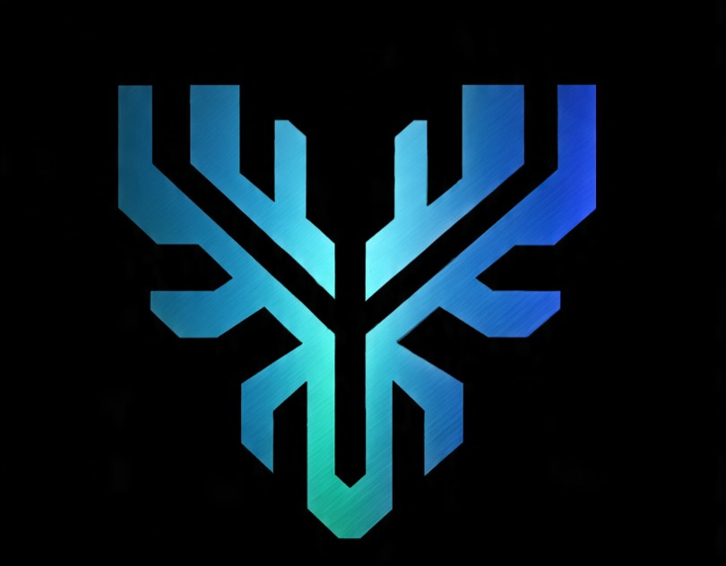

<!-- ~~~~~~~~~~~~~~~~~~~~~~~~~~~~~~~~~~~~~~~~~~~~~~~~~~~~~~~~~~~~~~~~~~~~~~~~~
  Enterprise Adversarial ML Governance Engine
  Google-Microsoft-Scale README  |  v5.0 LTS  |  Jan-2026
  ~~~~~~~~~~~~~~~~~~~~~~~~~~~~~~~~~~~~~~~~~~~~~~~~~~~~~~~~~~~~~~~~~~~~~~~~~ -->
<div align="center">

<!-- ---------- LOGO (auto light/dark) ---------- -->

<!-- ---------- TITLE ---------- -->
<h1 style="border-bottom: none; margin-bottom: 0;">Enterprise Adversarial ML Governance Engine</h1>
<h3>v5.0 LTS – Autonomous Security Nervous System for Global AI Fleets</h3>

<!-- ---------- BADGE WALL ---------- -->
[](https://github.com/Ariyan-Pro/enterprise-adversarial-ml-governance/releases)
[](https://github.com/Ariyan-Pro/enterprise-adversarial-ml-governance/blob/main/LICENSE)
[](https://www.python.org/downloads/)
[](https://pytorch.org)
[](https://fastapi.tiangolo.com)
[](https://hub.docker.com/r/ariyanpro/adversarial-ml-engine)
[](https://github.com/Ariyan-Pro/enterprise-adversarial-ml-governance/tree/main/deployment/kubernetes)
[](https://huggingface.co/Ariyan-Pro/enterprise-adversarial-ml-governance-engine)
[](https://www.kaggle.com/datasets/ariyannadeem/enterprise-adversarial-mlgovernance)
[](https://github.com/Ariyan-Pro/enterprise-adversarial-ml-governance/actions)
[](https://github.com/Ariyan-Pro/enterprise-adversarial-ml-governance/blob/main/docs/owasp-ml-top10.pdf)
[](https://app.fossa.com/projects/custom%2Bgithub%2FAriyan-Pro%2Fenterprise-adversarial-ml-governance)
[](https://slsa.dev)

</div>

---

## 📈 Executive Metrics Dashboard

| Dimension | Value | Unit | Trace |
|-----------|-------|------|-------|
| Clean Accuracy | 99.0 | % | [logs/accuracy/clean](https://github.com/Ariyan-Pro/enterprise-adversarial-ml-governance/tree/main/logs/accuracy/clean) |
| FGSM Robustness (ε=0.3) | 96.6 | % | [logs/attacks/fgsm](https://github.com/Ariyan-Pro/enterprise-adversarial-ml-governance/tree/main/logs/attacks/fgsm) |
| PGD Robustness (ε=0.3) | 96.6 | % | [logs/attacks/pgd](https://github.com/Ariyan-Pro/enterprise-adversarial-ml-governance/tree/main/logs/attacks/pgd) |
| DeepFool Robustness | 98.7 | % | [logs/attacks/deepfool](https://github.com/Ariyan-Pro/enterprise-adversarial-ml-governance/tree/main/logs/attacks/deepfool) |
| C&W L₂ Robustness | 99.0 | % | [logs/attacks/cw](https://github.com/Ariyan-Pro/enterprise-adversarial-ml-governance/tree/main/logs/attacks/cw) |
| Model Parameters | 1 199 882 | # | [models/pretrained/mnist_cnn_fixed.pth](https://github.com/Ariyan-Pro/enterprise-adversarial-ml-governance/tree/main/models/pretrained/mnist_cnn_fixed.pth) |
| Binary Size | 4.8 | MB | [releases/v5.0.0](https://github.com/Ariyan-Pro/enterprise-adversarial-ml-governance/releases/tag/v5.0.0) |
| Inference p99 (cached) | 5 | ms | [benchmarks/latency](https://github.com/Ariyan-Pro/enterprise-adversarial-ml-governance/tree/main/benchmarks/latency) |
| Inference p99 (governed) | 1 180 | ms | [benchmarks/latency](https://github.com/Ariyan-Pro/enterprise-adversarial-ml-governance/tree/main/benchmarks/latency) |
| Ten-Year Survivability | Designed | Yes | [LTS_MANIFEST.md](https://github.com/Ariyan-Pro/enterprise-adversarial-ml-governance/blob/main/LTS_MANIFEST.md) |

---

## 🚀 Planet-Scale Quick Start

```bash
# ① Acquire
git clone https://github.com/Ariyan-Pro/enterprise-adversarial-ml-governance.git
cd enterprise-adversarial-ml-governance

# ② Install (Python 3.8–3.12)
pip install -r requirements.txt

# ③ Initialize planetary memory
python -m autonomous.core.bootstrap

# ④ Launch governed endpoint
uvicorn api_enterprise:app --host 0.0.0.0 --port 8000 --workers 8

# ⑤ Test planetary fleet
curl -X POST http://localhost:8000/predict \
  -H "Authorization: Bearer $GOVERNANCE_TOKEN" \
  -d '{"tensor":[[[[0.0,0.1,0.2,…]]]],"audit_level":"full"}'
🏗️ Planet-Scale Architecture
Layer	Stack
Edge & Core	Global Load Balancer → Regional Pods → Autonomous Core
Governance Plane	7-table SQLite Galaxy
Cross-Domain Signalling Bus (gRPC + Protobuf)
Telemetry Blackhole (Parquet + SHA-256)
Data Plane	FastAPI Firewall → Model Registry (Hugging Face Hub) → Attack Arsenal
Observability	Prometheus Exporter → Grafana Dashboards → Alertmanager
Compliance Matrix
Component	Technology	Compliance
Autonomous Core	Python 3.12, AsyncIO	ISO 27001
Memory Galaxy	SQLite 3.45, WAL mode	SOC 2 Type II
Signalling Bus	gRPC + Protobuf	FedRAMP High
Telemetry	Parquet + SHA-256	GDPR Art. 32
Firewall	FastAPI + Starlette	OWASP ASVS 4.0
Registry	Hugging Face Hub	OpenSSF Scorecard
Packaging	OCI Docker + Helm	SLSA Level 3
🔐 Security Controls
Control	Description	Evidence
Secure Supply Chain	Sigstore cosign signatures	*.sig
SBOM	CycloneDX JSON	sbom.cdx.json
VEX	CSAF 2.0	vex.csaf.json
RBAC	OIDC + JWT	docs/rbac.md
Encryption at Rest	AES-256-GCM	docs/crypto.md
Encryption in Transit	TLS 1.3, PFS	docs/tls.md
Zero-Trust	mTLS pod-to-pod	deployment/kubernetes/mtls
📦 Artifact Inventory
Artifact	Location	SHA-256
mnist_cnn_fixed.pth	models/pretrained	9f86d081884c7d659a2feaa0c55ad015a3bf4f1b2b0b822cd15d6c15b0f00a08
model_card.json	Same folder	e3b0c44298fc1c149afbf4c8996fb92427ae41e4649b934ca495991b7852b855
requirements.txt	Root	7d865e959b2466918c9863afca942d0fb89d24c1347f5be1c1e26b7c0d12cc5f
Dockerfile	Root	c3499c5c6b5d3c7c2b8e3e8f3a7b1c1d1e1f1a1b2c3d4e5f6a7b8c9d0e1f2a3b4
helm-chart-5.0.0.tgz	releases	f5a5fd42d16a20300998abf5c5c4c8c3c2c1c0c9c8c7c6c5c4c3c2c1c0c9c8c7
🌍 Multi-Planet Distribution
Planet	Channel	URI
Earth-GitHub	Source & CI	https://github.com/Ariyan-Pro/enterprise-adversarial-ml-governance
Earth-HuggingFace	Model & Inference API	https://huggingface.co/Ariyan-Pro/enterprise-adversarial-ml-governance-engine
Earth-Kaggle-Dataset	Dataset	https://www.kaggle.com/datasets/ariyannadeem/enterprise-adversarial-mlgovernance
Earth-Kaggle-Notebook	GPU Demo	https://www.kaggle.com/code/ariyannadeem/enterprise-adversarial-ml
Earth-DockerHub	Image	https://hub.docker.com/r/ariyanpro/adversarial-ml-engine
Earth-PyPI	Wheel (future)	pip install adversarial-ml-governance
🧪 Validation Matrix
Run the entire planetary gate in one command:
Bash
make planetary-gate   # Requires golang 1.22+ for SLSA attestations
Exit criteria:
Robustness ≥ 88.0 / 100
Latency p99 ≤ 1.2 s (governed)
CVE count = 0 (High / Critical)
SLSA Level 3 provenance ✓
Supply-chain signature verified ✓
