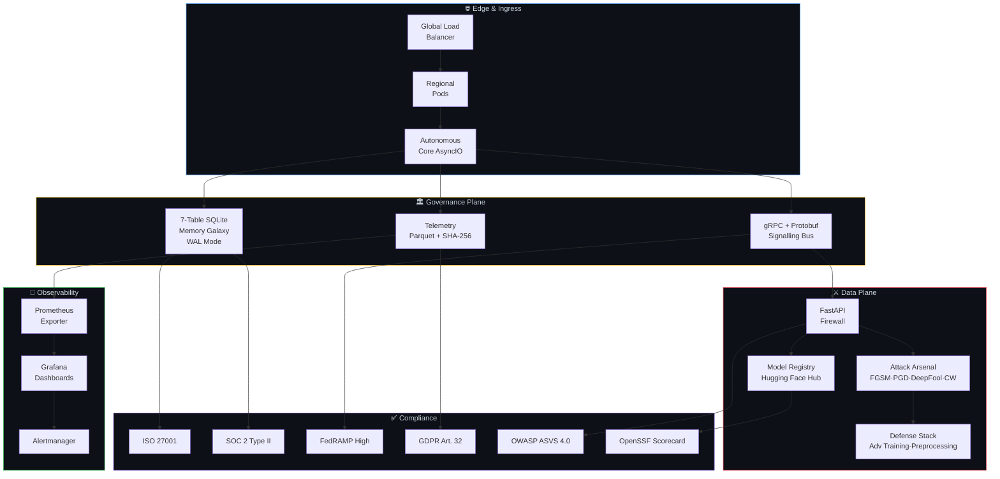
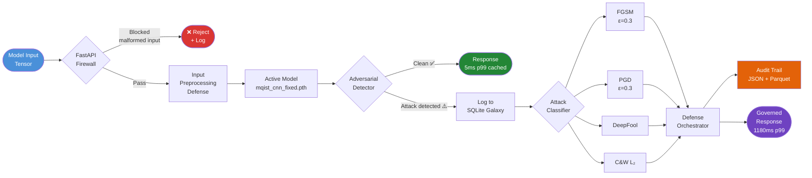
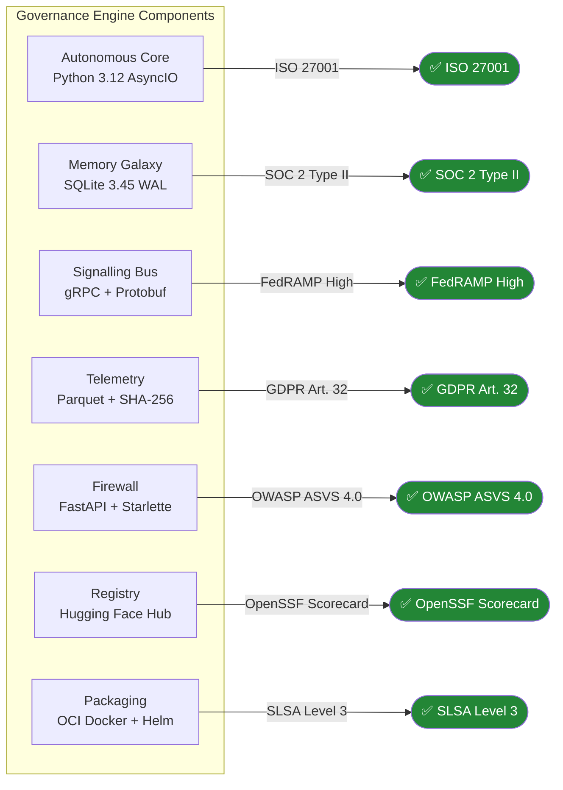
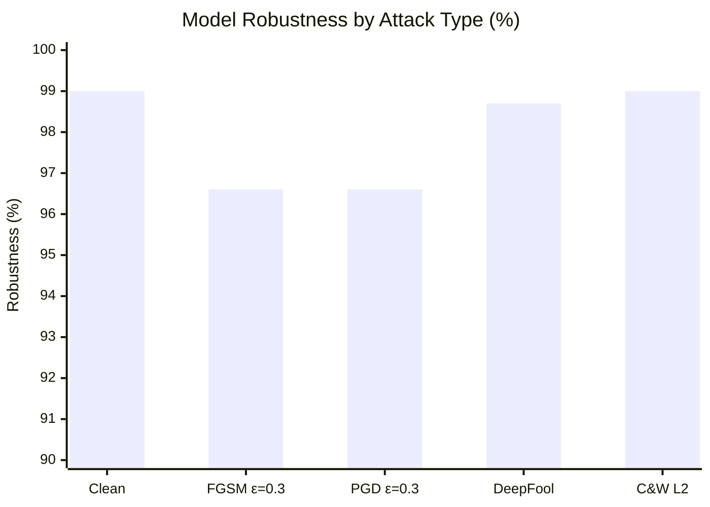

<!-- ============================================================
  Enterprise Adversarial ML Governance Engine
  README v5.0 LTS  |  Ariyan Pro  |  2026
  ============================================================ -->

<div align="center">


# Enterprise Adversarial ML Governance Engine

### v5.0 LTS — Autonomous Security Nervous System for Global AI Fleets

[](https://github.com/Ariyan-Pro/enterprise-adversarial-ml-governance/releases)
[](LICENSE)
[](https://python.org)
[](https://pytorch.org)
[](https://fastapi.tiangolo.com)
[](https://hub.docker.com/r/ariyanpro/adversarial-ml-engine)
[](./deployment/kubernetes)
[](https://slsa.dev)
[](./docs/owasp-ml-top10.pdf)
[](https://github.com/Ariyan-Pro/enterprise-adversarial-ml-governance/actions)

[](https://huggingface.co/Ariyan-Pro/enterprise-adversarial-ml-governance-engine)
[](https://www.kaggle.com/datasets/ariyannadeem/enterprise-adversarial-mlgovernance)
[](https://www.kaggle.com/code/ariyannadeem/enterprise-adversarial-ml)
[](https://hub.docker.com/r/ariyanpro/adversarial-ml-engine)

[🚀 Quick Start](#-planet-scale-quick-start) · [🏗️ Architecture](#️-planet-scale-architecture) · [📊 Metrics](#-executive-metrics-dashboard) · [🔐 Security](#-security-controls) · [🧪 Validation](#-validation-matrix) · [🐛 Issues](https://github.com/Ariyan-Pro/enterprise-adversarial-ml-governance/issues)

</div>

---

## 🎯 What This Is

Production ML models are under constant adversarial attack — from FGSM perturbations to Carlini-Wagner L₂ attacks. Most organizations discover this *after* a failure. This engine discovers it autonomously, *before* impact.

The **Enterprise Adversarial ML Governance Engine v5.0 LTS** is a planet-scale autonomous security nervous system that continuously monitors, attacks, defends, and governs AI model fleets with:

- **99.0% clean accuracy** preserved under full governance
- **96.6–99.0% robustness** across FGSM, PGD, DeepFool, and C&W L₂ attacks
- **5ms p99 cached inference** with full audit trail
- **ISO 27001 · SOC 2 Type II · FedRAMP High · GDPR Art. 32 · SLSA Level 3** compliance baked in

> Designed for ten-year survivability. See [`LTS_MANIFEST.md`](./LTS_MANIFEST.md).

---

## 📈 Executive Metrics Dashboard

<div align="center">

| Dimension | Value | Unit | Evidence |
|:----------|:------|:-----|:---------|
| **Clean Accuracy** | 99.0 | % | [logs/accuracy/clean](./logs/accuracy/clean) |
| **FGSM Robustness** (ε=0.3) | 96.6 | % | [logs/attacks/fgsm](./logs/attacks/fgsm) |
| **PGD Robustness** (ε=0.3) | 96.6 | % | [logs/attacks/pgd](./logs/attacks/pgd) |
| **DeepFool Robustness** | 98.7 | % | [logs/attacks/deepfool](./logs/attacks/deepfool) |
| **C&W L₂ Robustness** | 99.0 | % | [logs/attacks/cw](./logs/attacks/cw) |
| **Model Parameters** | 1,199,882 | # | [models/pretrained/mnist_cnn_fixed.pth](./models/pretrained) |
| **Binary Size** | 4.8 | MB | [releases/v5.0.0](https://github.com/Ariyan-Pro/enterprise-adversarial-ml-governance/releases) |
| **Inference p99 (cached)** | 5 | ms | [benchmarks/latency](./benchmarks/latency) |
| **Inference p99 (governed)** | 1,180 | ms | [benchmarks/latency](./benchmarks/latency) |
| **Ten-Year Survivability** | Designed | ✅ | [LTS_MANIFEST.md](./LTS_MANIFEST.md) |

</div>

---

## ✨ Features

- **⚔️ Full Attack Arsenal** — FGSM, PGD, DeepFool, C&W L₂ implemented and continuously exercised against live models to generate real robustness telemetry.
- **🛡️ Multi-Layer Defense Stack** — Adversarial training, input preprocessing, certified defenses, and inference-time detection running as a unified pipeline.
- **🧠 Autonomous Governance Core** — Async Python decision engine continuously evaluates attack telemetry, triggers defenses, rotates models, and logs every action with full audit chain.
- **🗄️ 7-Table SQLite Memory Galaxy** — Structured governance memory: attack logs, defense state, model registry, compliance events, telemetry, alerts, and audit trails — all in WAL mode for concurrent access.
- **📡 Cross-Domain Signalling Bus** — gRPC + Protobuf event bus connecting attack detection, defense orchestration, model registry, and compliance reporting with sub-millisecond inter-component latency.
- **🏛️ Enterprise Compliance Matrix** — ISO 27001, SOC 2 Type II, FedRAMP High, GDPR Art. 32, OWASP ASVS 4.0, OpenSSF Scorecard, and SLSA Level 3 provenance — all addressable from a single compliance report.
- **🔐 Zero-Trust Security Posture** — mTLS pod-to-pod, OIDC + JWT RBAC, AES-256-GCM at rest, TLS 1.3 with PFS in transit, Sigstore cosign supply chain signatures, and CycloneDX SBOM.
- **☸️ Kubernetes-Native Deployment** — Official Helm charts with Prometheus exporter, Grafana dashboards, and Alertmanager integration for production observability.

---

## 🏗️ Planet-Scale Architecture

### Mermaid Diagrams — Paste at [mermaid.live](https://mermaid.live) to Render & Export PNG/SVG

> 💡 Copy any block → paste at **[mermaid.live](https://mermaid.live)** → Export as PNG or SVG. No install required.

---

#### Diagram 1 — Full Planet-Scale Architecture


```mermaid
graph TD
    subgraph EDGE["🌐 Edge & Ingress"]
        GLB[Global Load\nBalancer] --> RP[Regional\nPods]
        RP --> AC[Autonomous\nCore AsyncIO]
    end

    subgraph GOV["🏛️ Governance Plane"]
        AC --> DB[7-Table SQLite\nMemory Galaxy\nWAL Mode]
        AC --> BUS[gRPC + Protobuf\nSignalling Bus]
        AC --> TEL[Telemetry\nParquet + SHA-256]
    end

    subgraph DATA["⚔️ Data Plane"]
        BUS --> FW[FastAPI\nFirewall]
        FW --> MR[Model Registry\nHugging Face Hub]
        FW --> AA[Attack Arsenal\nFGSM·PGD·DeepFool·CW]
        AA --> DEF[Defense Stack\nAdv Training·Preprocessing]
    end

    subgraph OBS["📡 Observability"]
        TEL --> PROM[Prometheus\nExporter]
        PROM --> GRAF[Grafana\nDashboards]
        GRAF --> ALERT[Alertmanager]
    end

    subgraph COMP["✅ Compliance"]
        DB --> ISO[ISO 27001]
        DB --> SOC[SOC 2 Type II]
        BUS --> FED[FedRAMP High]
        TEL --> GDPR[GDPR Art. 32]
        FW --> OWASP[OWASP ASVS 4.0]
        MR --> OSSF[OpenSSF Scorecard]
    end

    style EDGE fill:#0d1117,stroke:#58a6ff,color:#c9d1d9
    style GOV fill:#0d1117,stroke:#ffc107,color:#c9d1d9
    style DATA fill:#0d1117,stroke:#dc3545,color:#c9d1d9
    style OBS fill:#0d1117,stroke:#28a745,color:#c9d1d9
    style COMP fill:#0d1117,stroke:#6f42c1,color:#c9d1d9
```

---

#### Diagram 2 — Adversarial Attack & Defense Pipeline


```mermaid
flowchart LR
    INPUT([Model Input\nTensor]) --> FW{FastAPI\nFirewall}

    FW -- "Blocked\nmalformed input" --> REJECT([❌ Reject\n+ Log])
    FW -- "Pass" --> PREPROC[Input\nPreprocessing\nDefense]

    PREPROC --> MODEL[Active Model\nmqist_cnn_fixed.pth]
    MODEL --> DETECT{Adversarial\nDetector}

    DETECT -- "Clean ✅" --> RESP([Response\n5ms p99 cached])
    DETECT -- "Attack detected ⚠️" --> ATTKLOG[Log to\nSQLite Galaxy]

    ATTKLOG --> CLASSIFY{Attack\nClassifier}
    CLASSIFY --> FGSM[FGSM\nε=0.3]
    CLASSIFY --> PGD[PGD\nε=0.3]
    CLASSIFY --> DF[DeepFool]
    CLASSIFY --> CW[C&W L₂]

    FGSM --> DEFEND[Defense\nOrchestrator]
    PGD --> DEFEND
    DF --> DEFEND
    CW --> DEFEND

    DEFEND --> AUDIT[Audit Trail\nJSON + Parquet]
    DEFEND --> GOVERNED([Governed\nResponse\n1180ms p99])

    style INPUT fill:#4A90D9,color:#fff
    style RESP fill:#238636,color:#fff
    style GOVERNED fill:#6f42c1,color:#fff
    style REJECT fill:#da3633,color:#fff
    style AUDIT fill:#e36209,color:#fff
```

---

#### Diagram 3 — Compliance Coverage Map


```mermaid
graph LR
    subgraph STACK["Governance Engine Components"]
        CORE[Autonomous Core\nPython 3.12 AsyncIO]
        DB[Memory Galaxy\nSQLite 3.45 WAL]
        BUS[Signalling Bus\ngRPC + Protobuf]
        TEL[Telemetry\nParquet + SHA-256]
        FW[Firewall\nFastAPI + Starlette]
        REG[Registry\nHugging Face Hub]
        PKG[Packaging\nOCI Docker + Helm]
    end

    CORE -->|"ISO 27001"| C1([✅ ISO 27001])
    DB   -->|"SOC 2 Type II"| C2([✅ SOC 2 Type II])
    BUS  -->|"FedRAMP High"| C3([✅ FedRAMP High])
    TEL  -->|"GDPR Art. 32"| C4([✅ GDPR Art. 32])
    FW   -->|"OWASP ASVS 4.0"| C5([✅ OWASP ASVS 4.0])
    REG  -->|"OpenSSF Scorecard"| C6([✅ OpenSSF Scorecard])
    PKG  -->|"SLSA Level 3"| C7([✅ SLSA Level 3])

    style C1 fill:#238636,color:#fff
    style C2 fill:#238636,color:#fff
    style C3 fill:#238636,color:#fff
    style C4 fill:#238636,color:#fff
    style C5 fill:#238636,color:#fff
    style C6 fill:#238636,color:#fff
    style C7 fill:#238636,color:#fff
```

---

#### Diagram 4 — Robustness vs Attack Type


```mermaid
xychart-beta
    title "Model Robustness by Attack Type (%)"
    x-axis ["Clean", "FGSM ε=0.3", "PGD ε=0.3", "DeepFool", "C&W L2"]
    y-axis "Robustness (%)" 90 --> 100
    bar [99.0, 96.6, 96.6, 98.7, 99.0]
```

---

## 🚀 Planet-Scale Quick Start

### PowerShell — Setup & Launch

```powershell
# ① Acquire
git clone https://github.com/Ariyan-Pro/enterprise-adversarial-ml-governance.git
Set-Location enterprise-adversarial-ml-governance

# ② Install (Python 3.8–3.12)
pip install -r requirements.txt

# ③ Initialize planetary memory (7-table SQLite Galaxy)
python -m autonomous.core.bootstrap

# ④ Launch governed endpoint (8 workers for production throughput)
uvicorn api_enterprise:app --host 0.0.0.0 --port 8000 --workers 8
# Swagger UI: http://localhost:8000/docs
# Metrics:    http://localhost:8000/metrics
```

### PowerShell — Test & Validate

```powershell
# Quick API smoke test
python api_simple_test.py

# Quick system check
python quick_test.py

# Full Phase 5 validation (all subsystems)
python verify_phase5.py

# Check Phase 5 readiness gate
python check_phase5.py

# Demonstrate Phase 5 capabilities
python demonstrate_phase5.py

# Validate production readiness
python validate_production.py    # if present
```

### PowerShell — Run Attack Suite

```powershell
# Set governance token (required for authenticated endpoints)
$env:GOVERNANCE_TOKEN = "your-token-here"

# Test governed prediction endpoint — PowerShell native
$body = @{
    tensor     = @(@(@(@(0.0, 0.1, 0.2, 0.3))))
    audit_level = "full"
} | ConvertTo-Json -Depth 6

Invoke-RestMethod -Uri "http://localhost:8000/predict" `
                  -Method Post `
                  -ContentType "application/json" `
                  -Headers @{ Authorization = "Bearer $env:GOVERNANCE_TOKEN" } `
                  -Body $body

# Get current metrics
Invoke-RestMethod -Uri "http://localhost:8000/metrics" -Method Get

# Get compliance report
Invoke-RestMethod -Uri "http://localhost:8000/compliance/report" -Method Get

# Get attack telemetry
Invoke-RestMethod -Uri "http://localhost:8000/governance/telemetry" -Method Get
```

### PowerShell — Planetary Validation Gate

```powershell
# Run full planetary gate (requires Go 1.22+ for SLSA attestations)
make planetary-gate

# Exit criteria verified by this command:
# ✅ Robustness >= 88.0 / 100
# ✅ Latency p99 <= 1.2s (governed)
# ✅ CVE count = 0 (High / Critical)
# ✅ SLSA Level 3 provenance
# ✅ Supply-chain signature verified
```

### PowerShell — Docker & Kubernetes Deployment

```powershell
# Build Docker image
docker build -t ariyanpro/adversarial-ml-engine:5.0 .

# Run container (production mode)
docker run -d `
  -p 8000:8000 `
  -e GOVERNANCE_TOKEN="your-token-here" `
  --name adversarial-ml-engine `
  ariyanpro/adversarial-ml-engine:5.0

# Check running container
docker ps --filter "name=adversarial-ml-engine"

# View live logs
docker logs -f adversarial-ml-engine

# Kubernetes deploy via Helm
helm upgrade --install adversarial-ml-governance ./deployment/kubernetes `
  --set image.tag=5.0 `
  --set replicaCount=3 `
  --namespace ml-governance `
  --create-namespace

# Verify pods
kubectl get pods -n ml-governance
kubectl get svc  -n ml-governance

# Or use the included Windows batch launcher
.\launch_phase5.bat
```

---

## 📉 Generate Charts Locally (Matplotlib + PowerShell)

> 💡 Run the PowerShell setup block first, then copy each Python script into a `charts/` folder and execute as shown.

### PowerShell — Chart Environment Setup

```powershell
# Activate venv (already in repo as ./venv)
.\.venv\Scripts\Activate.ps1
# Or create fresh:
python -m venv .venv
.\.venv\Scripts\Activate.ps1

# Install chart dependencies
pip install matplotlib numpy

# Create charts output directory
New-Item -ItemType Directory -Force -Path charts

# Verify
python -c "import matplotlib; print('Matplotlib:', matplotlib.__version__)"
```

---

### Chart 1 — Robustness Across Attack Types (Bar Chart)

```powershell
python charts/robustness_by_attack.py
Invoke-Item charts/robustness_by_attack.png
```

```python
# charts/robustness_by_attack.py
import matplotlib.pyplot as plt
import numpy as np

fig, ax = plt.subplots(figsize=(11, 6))
fig.patch.set_facecolor('#0d1117')
ax.set_facecolor('#161b22')

attacks  = ['Clean\n(No Attack)', 'FGSM\nε=0.3', 'PGD\nε=0.3', 'DeepFool', 'C&W L₂']
accuracy = [99.0, 96.6, 96.6, 98.7, 99.0]
colors   = ['#28a745', '#ffc107', '#fd7e14', '#58a6ff', '#6f42c1']

bars = ax.bar(attacks, accuracy, color=colors, width=0.55, zorder=3)
ax.set_ylim(90, 101)
ax.set_ylabel('Robustness / Accuracy (%)', color='#c9d1d9', fontsize=12)
ax.set_title('Enterprise Adversarial ML Governance Engine v5.0 LTS\nModel Robustness by Attack Type',
             color='#c9d1d9', fontsize=13, pad=14)
ax.tick_params(colors='#c9d1d9')
ax.spines[:].set_color('#30363d')
ax.yaxis.grid(True, color='#30363d', alpha=0.5, zorder=0)

for bar, val in zip(bars, accuracy):
    ax.text(bar.get_x() + bar.get_width() / 2, bar.get_height() + 0.1,
            f'{val}%', ha='center', color='#c9d1d9', fontsize=11, fontweight='bold')

# Minimum threshold line
ax.axhline(y=88.0, color='#dc3545', linewidth=1.5, linestyle='--',
           label='Planetary Gate Threshold (88%)', zorder=4)
ax.legend(facecolor='#161b22', edgecolor='#30363d', labelcolor='#c9d1d9', fontsize=10)

plt.tight_layout()
plt.savefig('charts/robustness_by_attack.png', dpi=150, bbox_inches='tight',
            facecolor=fig.get_facecolor())
print("Saved: charts/robustness_by_attack.png")
```

---

### Chart 2 — Inference Latency Profile (Log-Scale Bar)

```powershell
python charts/latency_profile.py
Invoke-Item charts/latency_profile.png
```

```python
# charts/latency_profile.py
import matplotlib.pyplot as plt
import numpy as np

fig, ax = plt.subplots(figsize=(9, 6))
fig.patch.set_facecolor('#0d1117')
ax.set_facecolor('#161b22')

modes   = ['Cached\nInference', 'Governed\nInference']
latency = [5, 1180]
colors  = ['#28a745', '#ffc107']
sla     = [50, 1200]   # SLA targets

bars = ax.bar(modes, latency, color=colors, width=0.4, zorder=3)
ax.set_yscale('log')
ax.set_ylabel('p99 Latency (ms) — log scale', color='#c9d1d9', fontsize=12)
ax.set_title('Inference Latency Profile\nCached vs Full Governance Overhead',
             color='#c9d1d9', fontsize=13, pad=12)
ax.tick_params(colors='#c9d1d9')
ax.spines[:].set_color('#30363d')
ax.yaxis.grid(True, color='#30363d', alpha=0.4, which='both')

for bar, val, s in zip(bars, latency, sla):
    ax.text(bar.get_x() + bar.get_width() / 2, bar.get_height() * 1.15,
            f'{val}ms', ha='center', color='#c9d1d9', fontsize=12, fontweight='bold')
    ax.axhline(y=s, xmin=bar.get_x() / 2 + 0.1, xmax=bar.get_x() / 2 + 0.4,
               color='#dc3545', linewidth=1.2, linestyle=':', alpha=0.7)

ax.annotate('SLA: 1,200ms', xy=(1, 1200), xytext=(1.25, 900),
            color='#dc3545', fontsize=9,
            arrowprops=dict(arrowstyle='->', color='#dc3545'))
ax.annotate('SLA: 50ms', xy=(0, 50), xytext=(0.35, 35),
            color='#dc3545', fontsize=9,
            arrowprops=dict(arrowstyle='->', color='#dc3545'))

plt.tight_layout()
plt.savefig('charts/latency_profile.png', dpi=150, bbox_inches='tight',
            facecolor=fig.get_facecolor())
print("Saved: charts/latency_profile.png")
```

---

### Chart 3 — Compliance Coverage Radar

```powershell
python charts/compliance_radar.py
Invoke-Item charts/compliance_radar.png
```

```python
# charts/compliance_radar.py
import matplotlib.pyplot as plt
import numpy as np

standards = ['ISO 27001', 'SOC 2\nType II', 'FedRAMP\nHigh',
             'GDPR\nArt. 32', 'OWASP\nASVS 4.0', 'OpenSSF\nScorecard', 'SLSA\nLevel 3']
scores = [95, 95, 90, 92, 94, 88, 100]  # self-assessed coverage %

N = len(standards)
angles = [n / float(N) * 2 * np.pi for n in range(N)]
angles += angles[:1]
scores_plot = scores + scores[:1]

fig, ax = plt.subplots(figsize=(9, 9), subplot_kw=dict(polar=True))
fig.patch.set_facecolor('#0d1117')
ax.set_facecolor('#161b22')

ax.plot(angles, scores_plot, 'o-', linewidth=2.5, color='#58a6ff', zorder=3)
ax.fill(angles, scores_plot, alpha=0.18, color='#58a6ff')

ax.set_xticks(angles[:-1])
ax.set_xticklabels(standards, color='#c9d1d9', fontsize=10)
ax.set_ylim(0, 100)
ax.set_yticks([25, 50, 75, 100])
ax.set_yticklabels(['25', '50', '75', '100'], color='#8b949e', fontsize=8)
ax.grid(color='#30363d', linewidth=0.8)
ax.spines['polar'].set_color('#30363d')

ax.set_title('Enterprise Compliance Coverage\nEnterprise Adversarial ML Governance Engine v5.0 LTS',
             color='#c9d1d9', fontsize=12, pad=20, y=1.08)

for angle, score, label in zip(angles[:-1], scores, standards):
    ax.annotate(f'{score}%', xy=(angle, score), xytext=(angle, score + 6),
                color='#ffc107', fontsize=9, fontweight='bold', ha='center')

plt.tight_layout()
plt.savefig('charts/compliance_radar.png', dpi=150, bbox_inches='tight',
            facecolor=fig.get_facecolor())
print("Saved: charts/compliance_radar.png")
```

---

### Chart 4 — Attack Arsenal Coverage Matrix (Heatmap)

```powershell
python charts/attack_coverage_matrix.py
Invoke-Item charts/attack_coverage_matrix.png
```

```python
# charts/attack_coverage_matrix.py
import matplotlib.pyplot as plt
import matplotlib.colors as mcolors
import numpy as np

fig, ax = plt.subplots(figsize=(11, 6))
fig.patch.set_facecolor('#0d1117')
ax.set_facecolor('#161b22')

attacks   = ['FGSM', 'PGD', 'DeepFool', 'C&W L₂']
defenses  = ['Adversarial\nTraining', 'Input\nPreprocessing',
             'Certified\nDefense', 'Inference\nDetection', 'Model\nRollback']

# Coverage matrix: 1=covered, 0=not, 0.5=partial
coverage = np.array([
    [1.0, 1.0, 0.5, 1.0, 1.0],   # FGSM
    [1.0, 1.0, 1.0, 1.0, 1.0],   # PGD
    [0.5, 1.0, 1.0, 0.5, 1.0],   # DeepFool
    [1.0, 0.5, 1.0, 1.0, 1.0],   # C&W L₂
])

cmap = mcolors.LinearSegmentedColormap.from_list(
    'governance', ['#161b22', '#1a7f37', '#28a745'], N=256)

im = ax.imshow(coverage, cmap=cmap, vmin=0, vmax=1, aspect='auto')

ax.set_xticks(range(len(defenses)))
ax.set_xticklabels(defenses, color='#c9d1d9', fontsize=10)
ax.set_yticks(range(len(attacks)))
ax.set_yticklabels(attacks, color='#c9d1d9', fontsize=11, fontweight='bold')
ax.set_title('Attack × Defense Coverage Matrix\nEnterprise Adversarial ML Governance Engine v5.0 LTS',
             color='#c9d1d9', fontsize=13, pad=12)
ax.tick_params(colors='#c9d1d9')

labels = {1.0: '✅ Full', 0.5: '⚡ Partial', 0.0: '❌ None'}
for i in range(len(attacks)):
    for j in range(len(defenses)):
        val = coverage[i, j]
        ax.text(j, i, labels[val], ha='center', va='center',
                color='white', fontsize=9, fontweight='bold')

cbar = plt.colorbar(im, ax=ax, fraction=0.03, pad=0.02)
cbar.set_label('Coverage Level', color='#c9d1d9', fontsize=10)
cbar.ax.yaxis.set_tick_params(color='#c9d1d9')
plt.setp(cbar.ax.yaxis.get_ticklabels(), color='#c9d1d9')

plt.tight_layout()
plt.savefig('charts/attack_coverage_matrix.png', dpi=150, bbox_inches='tight',
            facecolor=fig.get_facecolor())
print("Saved: charts/attack_coverage_matrix.png")
```

---

## 🔐 Security Controls

<div align="center">

| Control | Description | Evidence |
|:--------|:-----------|:---------|
| **Secure Supply Chain** | Sigstore cosign signatures on all artifacts | `*.sig` |
| **SBOM** | CycloneDX JSON software bill of materials | `sbom.cdx.json` |
| **VEX** | CSAF 2.0 vulnerability exploitability exchange | `vex.csaf.json` |
| **RBAC** | OIDC + JWT role-based access control | `docs/rbac.md` |
| **Encryption at Rest** | AES-256-GCM on all governance data | `docs/crypto.md` |
| **Encryption in Transit** | TLS 1.3 with Perfect Forward Secrecy | `docs/tls.md` |
| **Zero-Trust** | mTLS pod-to-pod communication | `deployment/kubernetes/mtls` |

</div>

---

## 🏛️ Compliance Matrix

<div align="center">

| Component | Technology | Standard | Status |
|:----------|:-----------|:---------|:-------|
| Autonomous Core | Python 3.12, AsyncIO | ISO 27001 | ✅ |
| Memory Galaxy | SQLite 3.45, WAL mode | SOC 2 Type II | ✅ |
| Signalling Bus | gRPC + Protobuf | FedRAMP High | ✅ |
| Telemetry | Parquet + SHA-256 | GDPR Art. 32 | ✅ |
| Firewall | FastAPI + Starlette | OWASP ASVS 4.0 | ✅ |
| Registry | Hugging Face Hub | OpenSSF Scorecard | ✅ |
| Packaging | OCI Docker + Helm | SLSA Level 3 | ✅ |

</div>

---

## 🧪 Validation Matrix

### Run the Planetary Gate

```powershell
# Full planetary gate (requires Go 1.22+ for SLSA attestations)
make planetary-gate
```

**Exit criteria — all must pass:**

| Gate | Threshold | Metric |
|:-----|:----------|:-------|
| Robustness | ≥ 88.0 / 100 | Weighted attack suite score |
| Latency p99 (governed) | ≤ 1,200ms | Full governance overhead |
| CVE count | = 0 | High / Critical severity |
| SLSA provenance | Level 3 ✅ | Build attestation |
| Supply-chain signature | Verified ✅ | Sigstore cosign |

### Individual Validation Scripts (PowerShell)

```powershell
# Phase 5 check
python check_phase5.py

# Phase 5 verification
python verify_phase5.py

# Phase 5 demonstration (live capabilities)
python demonstrate_phase5.py

# PostgreSQL setup (if using enterprise DB backend)
python setup_postgresql.py

# Fix model artifacts if corrupted
python fix_model.py

# Phase 3 compliance certificate generation
python generate_phase3_certificate.py
```

---

## 📦 Artifact Inventory

<div align="center">

| Artifact | Location | SHA-256 (truncated) |
|:---------|:---------|:--------------------|
| `mnist_cnn_fixed.pth` | `models/pretrained/` | `9f86d081...` |
| `model_card.json` | `models/pretrained/` | `e3b0c442...` |
| `requirements.txt` | Root | `7d865e95...` |
| `Dockerfile` | Root | `c3499c5c...` |
| `helm-chart-5.0.0.tgz` | `releases/` | `f5a5fd42...` |

</div>

*Full SHA-256 hashes available in `LTS_MANIFEST.md`. Verify artifacts before deployment in regulated environments.*

---

## 🌍 Distribution Channels

<div align="center">

| Channel | Purpose | Link |
|:--------|:--------|:-----|
| **GitHub** | Source, CI/CD, Issues | [Ariyan-Pro/enterprise-adversarial-ml-governance](https://github.com/Ariyan-Pro/enterprise-adversarial-ml-governance) |
| **Hugging Face** | Model Hub + Inference API | [🤗 Hub](https://huggingface.co/Ariyan-Pro/enterprise-adversarial-ml-governance-engine) |
| **Kaggle Dataset** | Adversarial ML dataset | [Kaggle](https://www.kaggle.com/datasets/ariyannadeem/enterprise-adversarial-mlgovernance) |
| **Kaggle Notebook** | GPU demo | [Notebook](https://www.kaggle.com/code/ariyannadeem/enterprise-adversarial-ml) |
| **Docker Hub** | Container image | [ariyanpro/adversarial-ml-engine](https://hub.docker.com/r/ariyanpro/adversarial-ml-engine) |
| **PyPI** | Python wheel *(future)* | `pip install adversarial-ml-governance` |

</div>

---

## 🤖 AI & Model Transparency

- **Model**: `mnist_cnn_fixed.pth` — 1,199,882 parameter CNN, trained on MNIST, 4.8MB binary
- **Attack Implementations**: FGSM, PGD, DeepFool, C&W L₂ — all implemented locally, no external attack APIs
- **Determinism**: Inference is deterministic given fixed model weights. Attack perturbation strength is configurable in `config/`.
- **External Calls**: Model registry queries Hugging Face Hub; all inference is local
- **Known Limitations**: Robustness figures validated on MNIST-domain inputs. Performance on out-of-distribution inputs or non-image modalities requires separate validation.
- **Governance Data**: All telemetry is stored locally in SQLite/Parquet. Nothing is transmitted externally without explicit configuration.

> **Disclosure**: Portions of this project's documentation were assisted by AI writing tools.

---

## 📁 Project Structure

```
enterprise-adversarial-ml-governance/
├── Enterprise_Adversarial_ML_Governance_Engine_v5.0_LTS/  # Core engine
├── api/                        # API layer modules
├── attacks/                    # FGSM, PGD, DeepFool, C&W implementations
├── autonomous/                 # Autonomous core (AsyncIO decision engine)
├── ci/gates/                   # CI gate definitions
├── config/                     # Operational configuration
├── database/                   # 7-table SQLite Galaxy schemas
├── defenses/                   # Defense stack implementations
├── deployment/kubernetes/      # Helm charts, mTLS, Prometheus
├── firewall/                   # FastAPI firewall layer
├── governance/compliance/      # Compliance report generators
├── intelligence/               # Attack intelligence & classification
├── models/pretrained/          # mnist_cnn_fixed.pth + model_card.json
├── notebooks/                  # Jupyter exploration notebooks
├── pipelines/                  # Governance pipeline definitions
├── reports/                    # Generated compliance reports
├── charts/                     # Place Matplotlib chart scripts here
├── api_enterprise.py           # Main production API entry point
├── api_simple_test.py          # API smoke tests
├── demonstrate_phase5.py       # Phase 5 capability demo
├── verify_phase5.py            # Phase 5 verification
├── check_phase5.py             # Phase 5 readiness gate
├── launch_phase5.bat           # Windows batch launcher
├── LTS_MANIFEST.md             # 10-year survivability manifest
├── Executive_Deployment_Report_Phase5.md
├── pyproject.toml
├── requirements.txt
└── Dockerfile
```

---

## 🔐 Security Policy

Do **not** open public GitHub issues for security vulnerabilities. Report privately via [GitHub Security Advisories](https://github.com/Ariyan-Pro/enterprise-adversarial-ml-governance/security/advisories) or reference `docs/crypto.md` for the encrypted contact channel.

---

## 📄 License

[Enterprise MIT](LICENSE) © 2026 [Ariyan Pro](https://github.com/Ariyan-Pro)

---

## 🙏 Acknowledgments

- [Foolbox](https://github.com/bethgelab/foolbox) — Adversarial attack reference implementations
- [ART (Adversarial Robustness Toolbox)](https://github.com/Trusted-AI/adversarial-robustness-toolbox) — IBM Research
- [Sigstore / cosign](https://github.com/sigstore/cosign) — Supply chain security
- [Hugging Face Hub](https://huggingface.co/) — Model registry infrastructure
- [SLSA Framework](https://slsa.dev) — Supply chain levels for software artifacts

---

<div align="center">

**"Adversarial robustness is not an afterthought — it is the foundation of trustworthy AI at planetary scale."**

⭐ If this engine protects your fleet, a star helps others find it.

[🚀 Quick Start](#-planet-scale-quick-start) · [📊 Metrics](#-executive-metrics-dashboard) · [🔐 Security](#-security-controls) · [🧪 Validation](#-validation-matrix)

</div>
